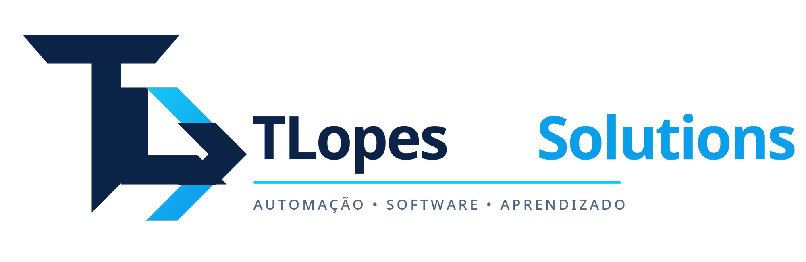

<div align="center">



# Thiago Lopes

### Engenheiro de Software · Automação · Sistemas Local-First · Fluxos Financeiros

<p>
Construo software para transformar processos manuais em operações
<strong>confiáveis, auditáveis e fáceis de usar</strong>.
</p>

<a href="https://github.com/tslopes88/FinanceAgent_Git">
  
</a>
<a href="https://github.com/tslopes88/DocFlow-Contabil-Portfolio">
  
</a>
<a href="https://github.com/tslopes88/app-tarefas-android-unificado">
  
</a>

</div>

## O que eu construo

Minha área de interesse é a interseção entre **automação de processos**,
**engenharia de dados**, **aplicações desktop** e **produtos financeiros**.

<p>
  <a href="https://github.com/tslopes88/FinanceAgent_Git">Ver projeto principal</a>
  ·
  <a href="https://github.com/tslopes88">Explorar repositórios</a>
  ·
  <a href="https://wa.me/5527992577542">Falar comigo</a>
</p>

```text
Problema operacional
        ↓
Fluxo simples para o usuário
        ↓
Validação determinística
        ↓
Auditoria e evidência
        ↓
Resultado reproduzível
```

Não busco apenas fazer uma aplicação funcionar. Busco construir sistemas que
possam ser **entendidos, verificados e mantidos**.

## Projetos em destaque

| Projeto | O que demonstra |
| --- | --- |
| [FinanceAgent](https://github.com/tslopes88/FinanceAgent_Git) | Conciliação bancária desktop, importação OFX/CSV, deduplicação e analytics |
| [DocFlow Contábil](https://github.com/tslopes88/DocFlow-Contabil-Portfolio) | Saneamento de OFX, conversão documental e validação pós-processamento |
| [App Tarefas Android](https://github.com/tslopes88/app-tarefas-android-unificado) | Organização de tarefas e experiência mobile |
| [FinanceAgent Portfolio](https://github.com/tslopes88/FinanceAgent-Portfolio) | Visão pública do produto e da arquitetura, sem o código proprietário |
| [Automação Contábil Meiri](https://github.com/tslopes88/Automacao-Contabil-Meiri-Portfolio) | Apresentação pública do fluxo de automação contábil |
| [TLopeCare-Pro](https://github.com/tslopes88/TLopeCare-Pro-Portfolio) | Diagnóstico e manutenção preventiva para Windows |
| [App Financeiro](https://github.com/tslopes88/App-Financeiro-Portfolio) | Produto local para receitas, despesas e metas |
| [Perfil de código](https://github.com/tslopes88) | Estudos, experimentos e evolução contínua |

## Princípios de engenharia

- **Evidência antes de opinião:** logs, testes e resultados reais têm prioridade.
- **Local-first quando privacidade importa:** dados sensíveis permanecem no
  ambiente do usuário sempre que possível.
- **Sugestão não é execução:** automação deve ter validação e rastreabilidade.
- **Falha explícita:** erros não devem virar sucesso silencioso.
- **Produto antes de complexidade:** tecnologia deve reduzir trabalho, não
  aumentar a carga operacional.

## Tecnologias

<p>


</p>

## Em evolução

Estou aprofundando:

- arquitetura modular e testes de regressão;
- interfaces desktop orientadas a fluxo;
- automação contábil e processamento documental;
- governança de IA baseada em evidência;
- distribuição confiável de aplicações Windows.

Projetos privados e soluções em desenvolvimento não são listados aqui; os
repositórios públicos acima representam o material disponível para avaliação.

## Vamos conversar

📱 [WhatsApp](https://wa.me/5527992577542) · 💻 [GitHub](https://github.com/tslopes88)

<div align="center">

_Software útil é aquele que torna o trabalho mais claro, seguro e repetível._

</div>
